

  

  <a href="https://nylontech.net"><code>nylontech.net</code></a>&nbsp;&nbsp;•&nbsp;&nbsp;
  <a href="https://nylonhosting.org"><code>nylonhosting.org</code></a>

 

<!-- ───────────── OPEN SOURCE ───────────── -->

  

  <a href="https://github.com/NylonTechnologies/Discord-Nyl-Bot-Template-Economy"></a>
  <a href="https://github.com/NylonTechnologies/Discord-Nyl-Bot-Template-Moderation"></a>

  <a href="https://github.com/NylonTechnologies/Discord-Nyl-Bot-Template-Utility"></a>
  <a href="https://github.com/NylonTechnologies/Discord-Nyl-Economy-API"></a>

  <a href="https://github.com/NylonTechnologies/Discord-Nyl-Advanced-Moderation-API"></a>
  <a href="https://github.com/NylonTechnologies/Discord-Nyl-Levelcard-API"></a>

 

<!-- ───────────── PRODUCTS ───────────── -->

  

  <a href="https://nylonhosting.org"></a>
  <a href="https://nylontech.net/nylbconstruct"></a>

  <a href="https://nylontech.net/projectexodia"></a>

 

<!-- ───────────── APPS & GAMES ───────────── -->

  

  
  

 

  

